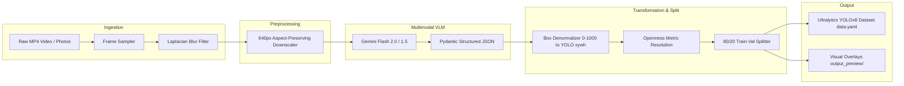

# VisionForge-AI: Architectural Specification & VLM Grounding Pipeline

## 1. Executive Summary

**VisionForge-AI** is a specialized multimodal data collection, auto-annotation, and dataset synthesis engine. It was developed to eliminate the manual data-labeling bottleneck in training edge computer vision models (such as **VisionWalk-Assist**).

By utilizing state-of-the-art Vision-Language Models (VLMs) like Google Gemini Flash alongside spatial reasoning prompts, VisionForge-AI converts raw video recordings and unannotated photos into production-grade YOLOv8 training datasets equipped with **aperture/openness percentages**.

---

## 2. End-to-End Pipeline Architecture

---

## 3. Token & Cost Optimization Strategy

Querying high-resolution images ($1080\text{p}$, $4\text{K}$) against commercial multimodal APIs consumes prohibitive token budgets. VisionForge-AI implements a multi-tiered cost suppression strategy:

1. **Spatial Dimension Capping:**
   Input frames are downscaled such that $\max(W, H) = 640\text{px}$. Because YOLO models train at $640\times640$, preserving excessive resolution beyond $640\text{px}$ produces zero downstream accuracy gain while multiplying token consumption by $4\times$ to $9\times$.
2. **Laplacian Blur Rejection:**
   Frames exhibiting motion blur are discarded prior to VLM submission using a Laplacian variance filter:
   $$\text{Var}(\nabla^2 I) < \tau_{\text{blur}} \implies \text{Discard Frame}$$
3. **Temporal Stride Subsampling:**
   Consecutive video frames in walking trajectories are redundant. The default frame sampler takes only 1 frame per $1.0\text{--}1.5\text{ seconds}$, reducing API calls by $97\%$ relative to raw 30 FPS video.
4. **Structured JSON Output:**
   By binding the API to a strict Pydantic schema, conversational overhead tokens are completely eliminated.

---

## 4. Coordinate Transformation & Mathematical Grounding

Gemini Vision models return normalized integer bounding boxes in the format:
$$\text{box\_2d} = [y_{\min}, x_{\min}, y_{\max}, x_{\max}] \quad \text{where } y, x \in [0, 1000]$$

YOLO format requires floating-point bounding box center coordinates and extents normalized to $[0.0, 1.0]$:
$$\begin{aligned}
x_{\text{center}} &= \frac{x_{\min} + x_{\max}}{2 \times 1000} \\
y_{\text{center}} &= \frac{y_{\min} + y_{\max}}{2 \times 1000} \\
w &= \frac{x_{\max} - x_{\min}}{1000} \\
h &= \frac{y_{\max} - y_{\min}}{1000}
\end{aligned}$$

---

## 5. Door Openness Hierarchy

VisionForge-AI evaluates not just the presence of a door, but its **traversability**:

| Percentage | Semantic Category | Description |
| :--- | :--- | :--- |
| **$0\%$** | `closed_door` | Latched, flush with frame, solid barrier. |
| **$10\%\text{--}30\%$** | `partially_open` (Ajar) | Small opening, handle unlatched, not yet walkable. |
| **$35\%\text{--}65\%$** | `partially_open` | Half-open door leaf; pedestrian clearance tight. |
| **$70\%\text{--}100\%$** | `wide_open` | Clear unobstructed passage through doorway. |
